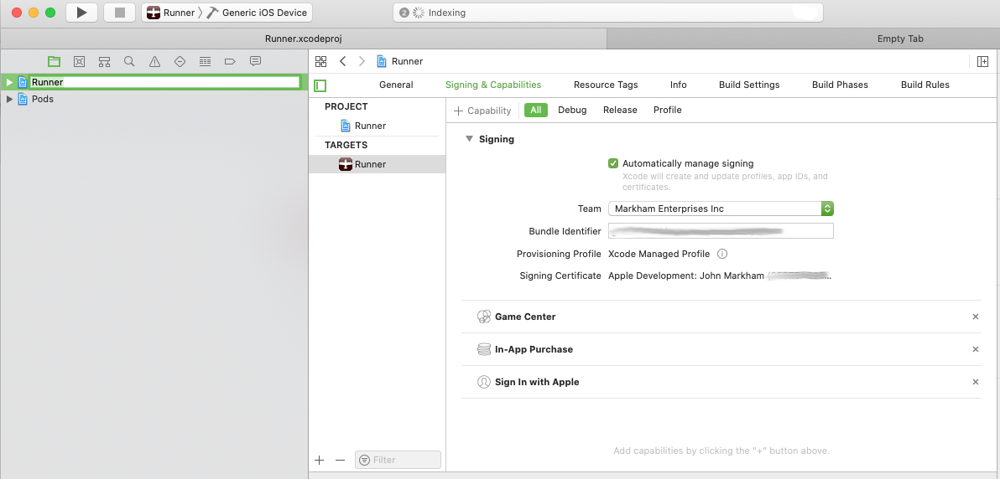
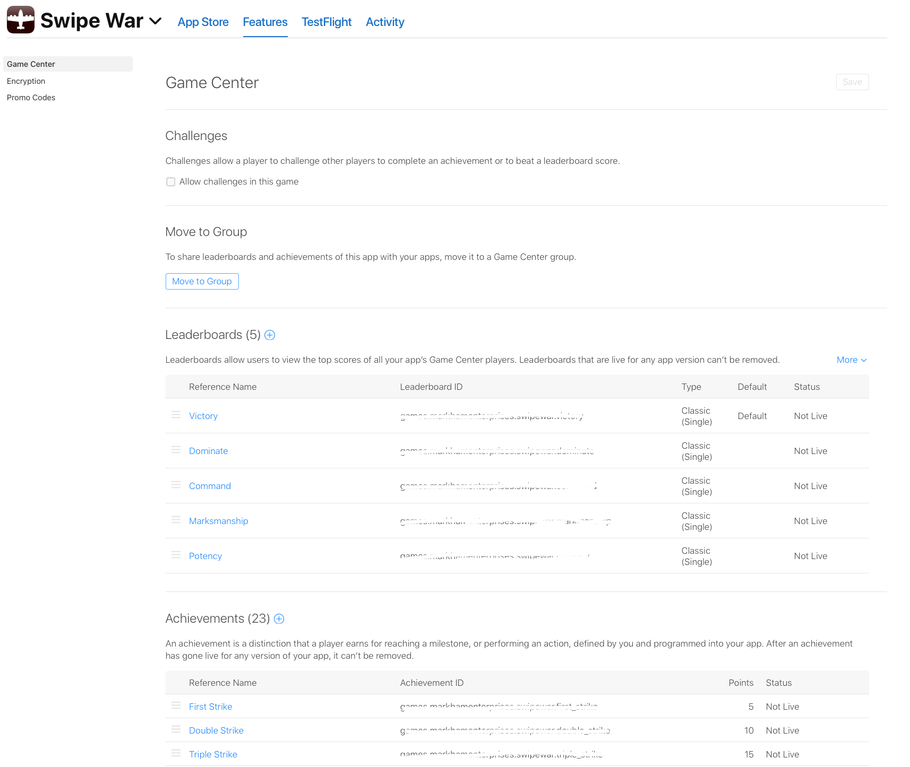

# ios_game_center

Flutter wrapper for the iOS Game Center: GameKit. There is an excellent wrapper for Android : https://pub.dev/packages/play_games which is well maintained. I designed the API for this plugin to resemble the API of that plugin.

## Part 1: Sign In 
The sign in is a method, and the return is an object that contains a success boolean and player data if successful. The return is a Future.
 
    final SignInResult _connect = await IOSGameCenter.signIn;
    if ( _connect.success) {
        this.account = result.account;
    } else {
        this.error = result.message;
    }
    this.loading = false;

Note : Sometimes Game Center will hang and seem to connect, but a connection will fail (you get the GameCenter welcome banner,  but the app won't be connected). I believe this is an issue more for developers who test on their phone's and are switching between accounts. If this happens then close the app. Logout and in of GameCenter directly then try the app again.
    
    
The Game Center Sign In will prompt on any app, but to actually connect you should add the GameCenter Service to your app via xCode.

    
    
Score Functions. You'll need to go to the App Store Connect (https://appstoreconnect.apple.com), Then select your app, then select Features, then Game Center, and there you add achievements and leaderboards.

 

## Part 2: Leaderboard
Show leaderboard:
For iOS you need to display a specific leaderboard to open the GameCenter Leaderboard lists. So pass in the leaderboard id (String). It is recommended you do the ids as bundles. The bundle should match you app id bundle. Return a success boolean as a Future.

    IOSGameCenter.showLeaderboard('games.mydomain.gamename.leaderboard_id') 
    
Posting a score: 
To submit you'll need to pass an id (String), and a score (int).  Return a
 success boolean as a Future.

    IOSGameCenter.submitScore(id:'games.mydomain.gamename.leaderboard_id', score: 200)

## Part 2: Achievements 
Show Achievements:
Opening the Achievements list is a straight method call and return a Future boolean:

    IOSGameCenter.showAchievements();

Post Achievements:
To post achievements you need to send an achievement id (String), again it should be a bundle id. The unlockAchievement complete the achievement and setPercentAchievement will set the current percentage as percent (double). So you need to track the achievement progress in your code. This returns a Future boolean:

    IOSGameCenter.unlockAchievement('games.mydomain.gamename.achievement_id');
    
    IOSGameCenter.setPercentAchievement(id: 'games.mydomain.gamename.achievement_id', percent: percent);
    
## Part 3: Future Development
Retrieve score data for both leaderboards and achievements. Get Image data for users. Pulls and collaborations welcome.   